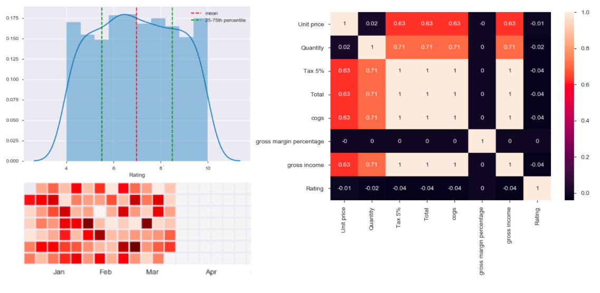

# Exploratory Data Analysis With Python and Pandas

### Libraries

- Pandas
- Numpy
- Matplotlib
- Seaborn
- Calmap
- Pandas Profiling

Link to data source: [Supermarket Sales Dataset](https://www.kaggle.com/aungpyaeap/supermarket-sales)

## Context

The growth of supermarkets in most populated cities is increasing, and market competition is also high. The dataset is one of the historical sales of a supermarket company, recorded in 3 different branches for 3 months of data.

## Data Dictionary

1. **Invoice id:** Computer-generated sales slip invoice identification number
2. **Branch:** Branch of supercenter (3 branches are available identified by A, B, and C).
3. **City:** Location of supercenters
4. **Customer type:** Type of customers, recorded by Members for customers using a member card and Normal for without a member card.
5. **Gender:** Gender type of customer
6. **Product line:** General item categorization groups - Electronic accessories, Fashion accessories, Food and beverages, Health and beauty, Home and lifestyle, Sports and travel
7. **Unit price:** Price of each product in USD
8. **Quantity:** Number of products purchased by the customer
9. **Tax:** 5% tax fee for customers buying
10. **Total:** Total price including tax
11. **Date:** Date of purchase (Record available from January 2019 to March 2019)
12. **Time:** Purchase time (10 am to 9 pm)
13. **Payment:** Payment used by the customer for purchase (3 methods are available – Cash, Credit card, and Ewallet)
14. **COGS:** Cost of goods sold
15. **Gross margin percentage:** Gross margin percentage
16. **Gross income:** Gross income
17. **Rating:** Customer stratification rating on their overall shopping experience (On a scale of 1 to 10)

## Task 1: Initial Data Exploration

1. Read the dataset and convert the "Date" column to the datetime type.
2. Set the "Date" column as the index for the DataFrame.
3. Display summary statistics for numeric columns.

## Task 2: Univariate Analysis

1. Explore the distribution of customer ratings and determine if it's skewed.
2. Visualize various numeric variables using histograms and analyze their distributions.
3. Examine aggregate sales numbers by branch and payment method.

## Task 3: Bivariate Analysis

1. Explore the relationship between gross income and customer ratings using scatter plots and regression analysis.
2. Compare gross income between different branches and genders using box plots.
3. Analyze the time trend in gross income.

## Task 4: Dealing With Duplicate Rows and Missing Values

1. Identify and remove duplicate rows in the dataset.
2. Handle missing values, either by filling them with appropriate values or removing them.
3. Use Pandas Profiling to generate a comprehensive report on the dataset.

## Task 5: Correlation Analysis

1. Calculate the correlation coefficient between gross income and customer ratings.
2. Analyze the correlation matrix of numeric variables and visualize it using a heatmap.

### Helpful Links

1. More visualizations: [Data-to-Viz](https://www.data-to-viz.com/)
2. Seaborn gallery: [Seaborn Examples](https://seaborn.pydata.org/examples/index.html)
3. Pandas profiling documentation: [Pandas Profiling](https://pypi.org/project/pandas-profiling/)
